# Capstone-Project

CAPSTONE PROJECT 
Sarah_Elzoubi
Safe Mind

1. 🧠 Project Title

 Safe Mind – A Mental health tracking Website/App

---

2. 📋 Project Description

       This project aims to create a mental health tracking app , where the user can journal about their thoughts, moods , struggles , and emotions. 
       The purpose of this APP/Website is to encourage people to let out their emotions , a lot of people suffer from mental health issues/personalities disorders , (like depression , anxiety, bpd , bipolar ..etc) and most people put on a smile in public while suffering in silence this Website/app encourages people to open up about their emotions even if it’s between the person and their phone, this app is free.

---

  3.   ERD For Mental-Heath-Tracker-App/Website (Safe Mind)
 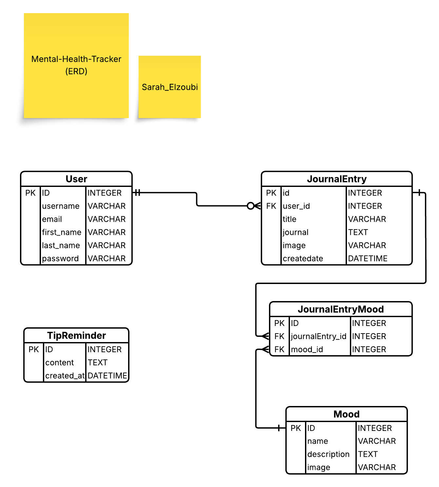

---

4. 🚀 Project Features

    • User authentication (signup, login, logout)
    • 
    • Create, edit, and delete journal entries
    • 
    • Mood tracking and analytics
    • 
    • Responsive design with a clean interface
    • 
    • Admin dashboard for content management
      
    • Delete Account 
    • Change Password
    • Display A Random Tip with each refresh 
      

---

5. 🧰 Technologies Used

Backend: Python, Django

Frontend: HTML, CSS, JavaScript

Database: PostgreSQL

Other Tools: Git, GitHub, pipenv, pillow , psycopg2-binary 

---

6. ⚙️ Installation and Setup

# 1️⃣ Clone the repository
git clone https://github.com/SarahElzoubi/Capstone-Project.git

# 2️⃣ Navigate to project folder
    • cd Capstone-Project
    • cd safemind_project

# 3️⃣ Create and activate virtual environment
    • pipenv shell

# 4️⃣ Install dependencies
    1. pipenv install django 
    2. pipenv install psycopg2-binary
    3. pip install pillow 
       
       

# 5️⃣ Apply migrations
    • Linux: python3 manage.py migrate 
    • Windows:python manage.py migrate

# 6️⃣ Run the development server
    • Linux: python3 manage.py runserver 
    • windows: Python manage.py runserver
      
Then open http://127.0.0.1:8000/ in your browser

---

7. 📖 User Stories
       
    • As a Guest I should be able to access the main page of the App/Website
   
    • As a Guest I should be able to sign up to the App/Website and create an account
   
    • As a User I should be able to Sign in to my App/Website Account
   
    • As a User I can Access my profile page , About page , and  the main page
   
    • As a User I should receive a daily reminder in my main page
   
    • As a User I should be able to create a Journal entry that I can journal in
   
    • As a User I can see my previous Journal entries in my main page
   
    • As a User I should be able to delete and update and of my journal entries
   
    • As a User I should be able to Logout of my Account
   
    • As a User I should be able to delete my account from my profile
   
    • As the Admin I can delete,update, and create accounts
   
    • As an Admin I have all the features of the User Account
   
    • As an Admin I monitor and manage content if necessary (optional feature for moderation or safety).

---

      8. 🗃️ Resources 
      
    • Emojis: https://emojipedia.org/ledger
    • Colors:https://colors.artyclick.com/color-shades-finder/?color=#000000
    • Colors:https://openreplay.com/tools/rgba-to-hex/
    • HTML , CSS & JS: https://www.w3schools.com/
    • Django:https://docs.djangoproject.com/en/5.2/
      

---

9. 📸 Screenshots (optional)
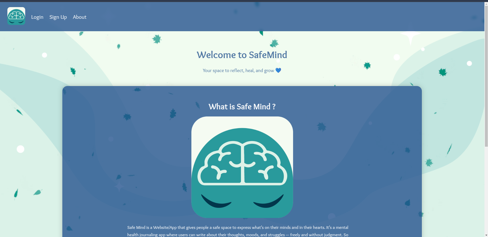
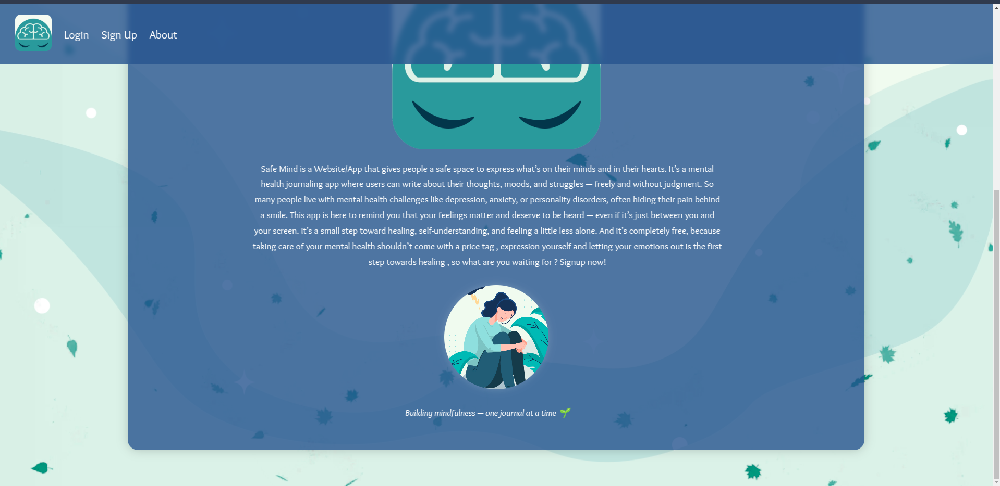
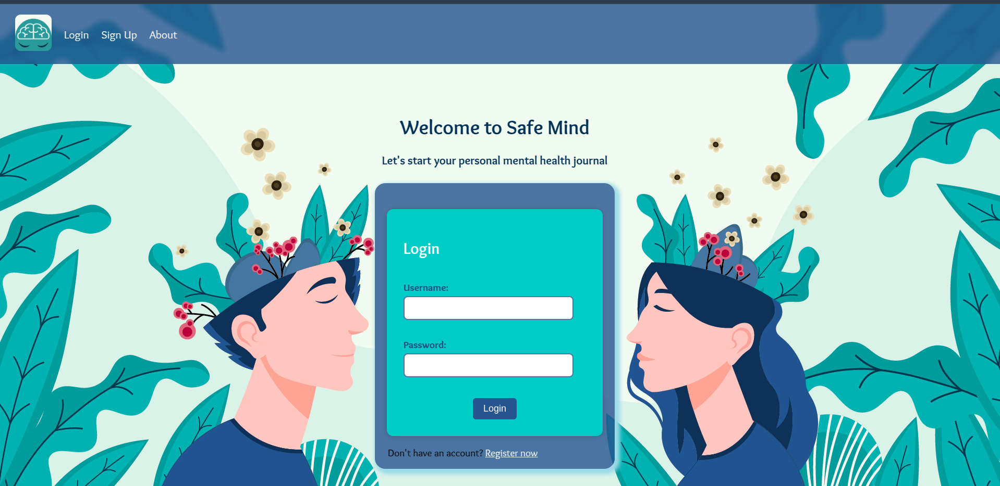

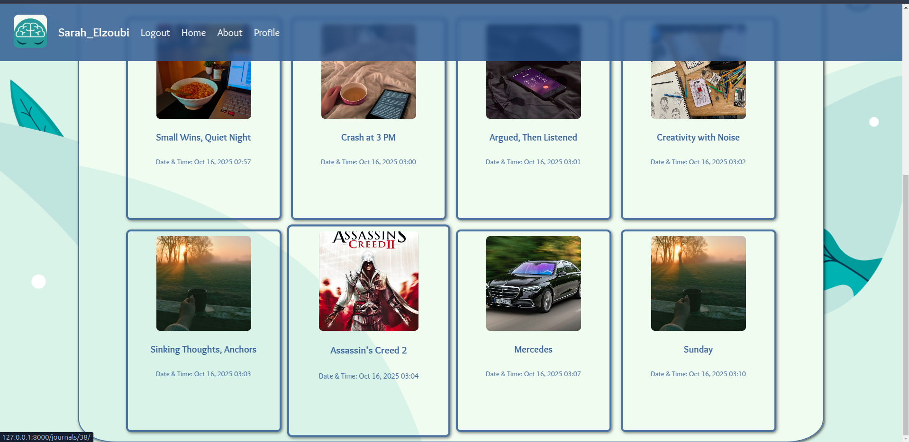
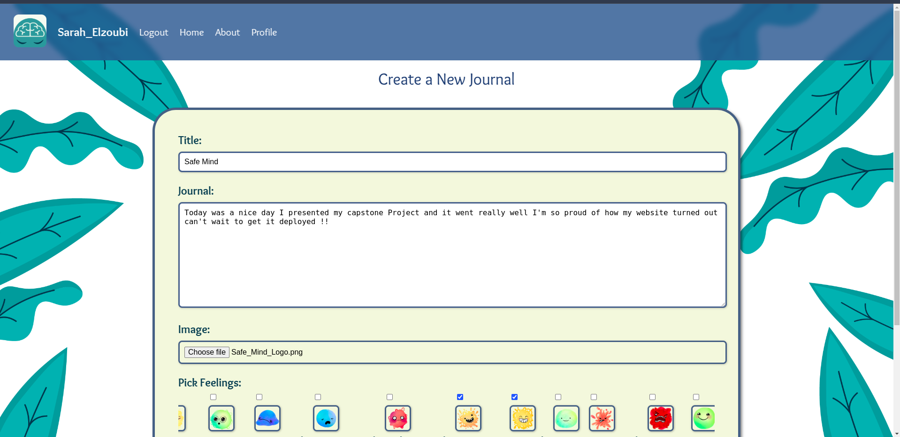
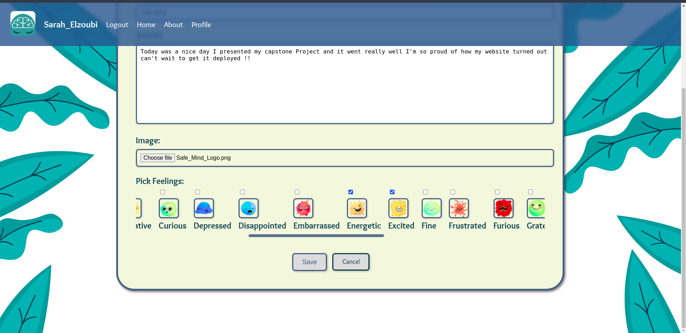
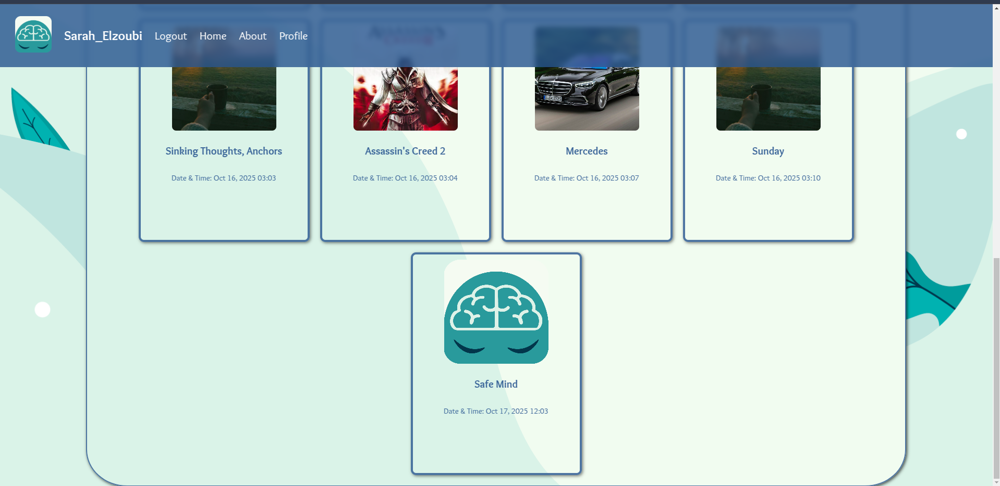
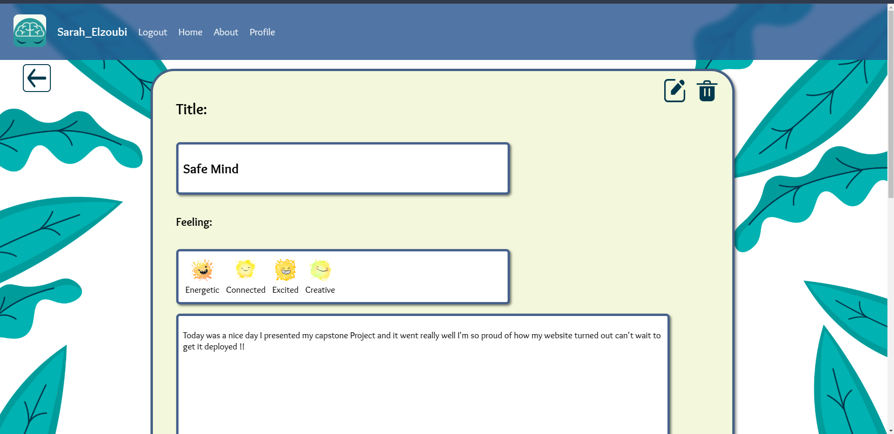
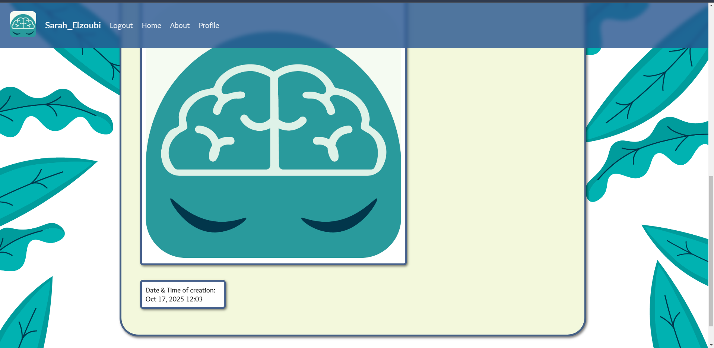
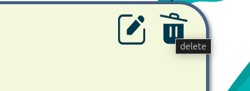
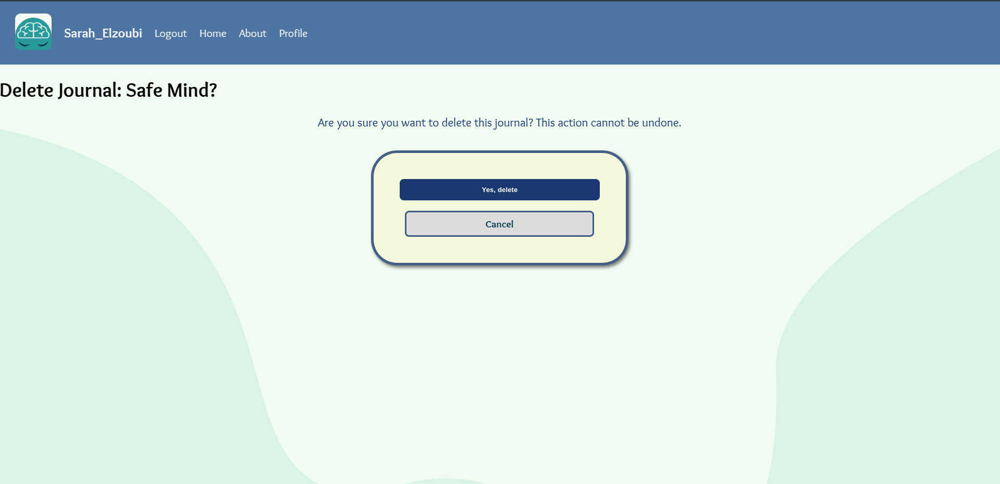
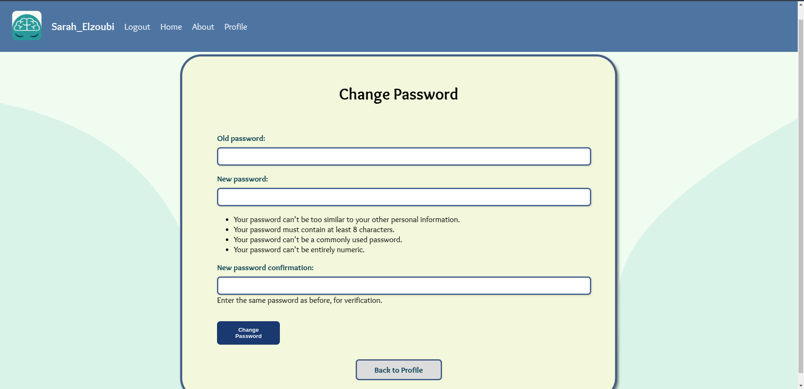
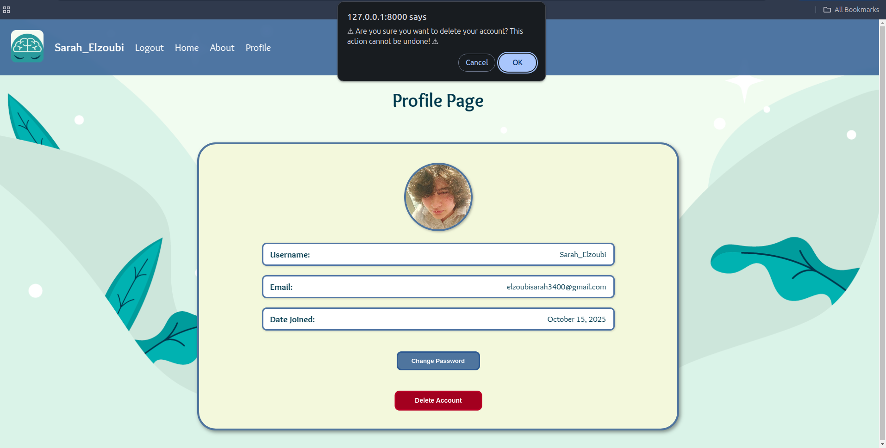

---

10. Challenges : 
       
    • Sign up page form wouldn't take margin-bottom ( too stuck on the bottom of the screen) , cliche but sometimes we all struggle with centreing a div 

    • Styling Django's sign up messages and error messages 

    • Styling Django's login error messages 
      
    • Moods to select multiple without JS.

    • Including a js function that renders 4 pics in the About. HTML template /page -> took a lot of time I just forgot to put the script in the header.
      
    • Redundant CSS tags in some big CSS files and overriding problem , fixed it by going through the code and reorganizing the classes.

---

 11. Future Work:

    • Profile : edit profile button (Update Profile)
      Include a profile model (User:1-1:Profile) where , user can upload their profile pic into.
      
    • Including a contact us model where the user can contact us via a message request  and they would get a notification in the nav bar ( notification section) User: 1-many requests 
      
    • Add a Search bar to search for journals faster

    • More animation with js 

    • Including an AI powered chat bot 

    • Future future : include psychologists and chat with them via text and maybe via video call for free.

---

12. 👩‍💻 Author

Name: Sarah Elzoubi

LinkedIn: https://www.linkedin.com/in/sarah-elzoubi-se/

GitHub: SarahElzoubi

